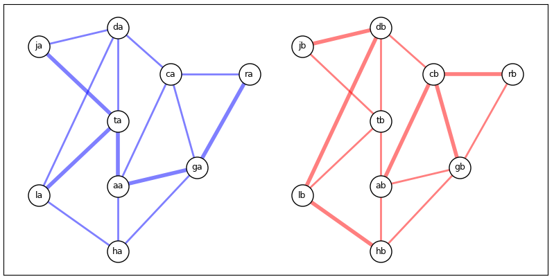

## NetworkX to evaluate SR MPLS networks  
Programs using NetworkX (Python3) for modeling SR MPLS deployments.  
### sr-te-srlg
_sr-te-srlg_ is used to evaluate SRLG links in an SR MPLS topology that has dual data planes (A & B).  A deployment where you have a single fiber with dual wavelenghts (A/B).  With this physical topology all links between diverse data planes would be an SRLG.  This program models the P-P nodes; it does not use PE.   Assumption is link coloring is used on the VRF export to color the traffic.  With a shared physical dual data plane (diverse routers), SR-TE could be used to "EXCLUDE" on B if A is primary.  A fiber (physical link) failure would only cause TI-LFA convergence on one data plane.  

